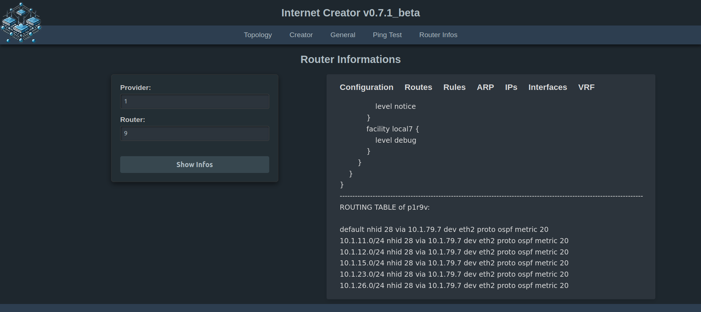

## Verwendungszwecke:

Es geht hier darum, drei Netzwerke (ISP's) bestehend aus jeweils 9 Vyos-Routern automatisiert unter PVE aufzusetzen und mit Ansible zu konfigurieren. Der Internet Creator steuert eine abgewandelte Version von [aibix0001 (Gerd's) provider.sh](https://github.com/aibix0001/aasil), die darauf ausgelegt ist, sich bzgl. der Arbeitsgeschwindigkeit an die Gegebenheiten verschieden starker CPU's anzupassen: So gibt es einen Turbomodus für Rechner mit besonders starken CPU's, einen Normalmodus für schwächere CPU's und einen seriellen Modus für besonders schwache CPU's. Um den passenden Modus für die jeweils verwendete CPU zu finden, siehe den Abschnitt 'Erfahrungswerte' im Readme.pdf.
Im Readme.pdf wird außerdem beschrieben, wie der Internet Creator auf Rechnern mit nur 16 GB RAM verwendet werden kann, sowie eine Menge weiterer Informationen zu seiner Arbeitsweise und Bedienung. Das [Aibix-Projekt](https://www.twitch.tv/aibix0001) wendet sich u.a. an Auszubildende und Studenten im IT-Bereich, sowie weitere Interessierte, die nicht unbedingt immer drei Kraftpakete zur Verfügung haben. Der Internet Creator ist deshalb insbesondere auch zur Verwendung mit schwächeren Rechnern entwickelt worden.

## Neueinsteiger

Für alle, die mit den [Streams](https://github.com/aibix0001/streams) von Aibix nicht von Anfang an vertraut sind, gibt es anstatt des Quickstarts das Setup.pdf, in dem der Aufbau des speziellen PVE-Setup's im Einzelnen beschrieben wird, innerhalb dessen der 'streams'-Ordner mit dem Internet Creator läuft.

## Besondere Voraussetzungen

sudo apt install jq

python3 -m venv .venv

source .venv/bin/activate

pip3 install -U setuptools wheel scp ansible paramiko flask flask-socketio gunicorn eventlet

## Quickstart

Nach dem Clonen dieses Repos den Ordner streams aus dem Ordner internet_creator_v0.7.1 herausnehmen und in den Pfad /home/user/ des PVE-Hosts ablegen und dann von da aus arbeiten.

Der Internet Creator wird folgendermaßen aufgerufen:

(1) ein vyos.qcow2 Image erstellen (siehe Setup.pdf) und unter /home/user/streams/create-vms/create-vms-vyos/ ablegen,

(2) für alle, deren User nicht user heißt: Am besten das Skript useradd.sh (als root) laufen lassen. Das spart eine Menge Arbeit (vgl. Readme_either.pdf Anmerkung (7)). Ansonsten im create-vm-vyos_XYfs.sh und im create-vm-vyos-turbo_XYfs.sh Zeile 43 anpassen. Außerdem sind die SSH-Credentials in der Datei user-data beim Erstellen der seed.iso anzupassen, sowie die ansible.cfg. 

(3) eine seed.iso erstellen (siehe Setup.pdf) und unter /var/lib/vz/template/iso ablegen.

Und dann eingeben:

source .venv/bin/activate

cd streams

./inc.sh

Bei der allerersten Verwendung auf jeden Fall die Option Refresh Vyos Upgrade Version anhaken, ansonsten findet kein Upgrade statt, sondern es wird diejenige Version verwendet, die dem vyos.qcow2 Image zugrunde liegt. Außerdem wird der Hostname dann nicht gesetzt (sondern bleibt 'vyos').

Nötigenfalls sudo-Password des Users im Terminal eingeben.

Nicht zusammen mit Dark Reader verwenden!

## Neue Features und spezielle Probleme der Version 0.7.1_beta

Statt auf einem Development-Server läuft die Web App auf einem professionellen Gunicorn Server. Obwohl das Frontend größtenteils unauffällig läuft, gibt es im Backend regelmäßig Fehlermeldungen, die bislang nicht abgestellt werden konnten. Zu Einzelheiten siehe 'Spezielle Probleme der Version 0.7.1_beta.pdf'. 

Achtung: Sobald man 'pip install gunicorn eventlet' in der .venv ausgeführt hat, wird der Ping Test und die Ausgabe der Router Infos unter Version 0.7 in dieser .venv nicht mehr funktionieren. Man braucht dann vorher:

pip uninstall gunicorn eventlet

## Troubleshooting

Insbesondere bei schwächeren/langsameren Rechnern kann es in seltenen Fällen Timeoutprobleme geben. Dazu bitte die Datei Timeoutprobleme.pdf lesen.

Sollte mal der (seltene) Fall eintreten, dass obwohl alles korrekt aussieht - die Configs der Router sind ok, es gibt ein DHCP-Lease von der pfSense und die VLAN-Tags des LAN Netzes stimmen auch (also 1011, 2011 bzw. 3011) - es aber trotzdem nicht möglich ist, raus zu pingen, dann alle Router restarten. Wenn es dann immer noch nicht geht, mit anderem (meistens höherem) Delay-Wert oder ggf. im Turbo Modus nochmal neu erzeugen.
